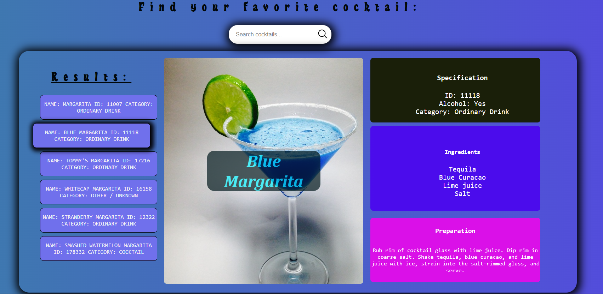
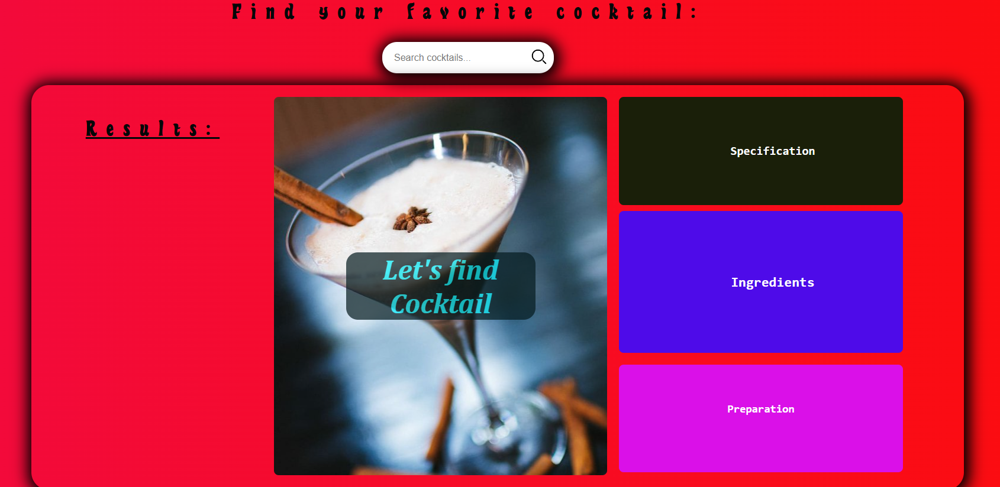

# Cocktail Recipe App

This project is a web application that allows users to search for cocktail recipes by entering the cocktail's name in the input field. The app dynamically fetches data from a cocktail API to display details such as the cocktail's ingredients, preparation instructions, and characteristics. Additionally, it generates a list of cocktails matching the user's input, and users can click on any cocktail from the list to view its full recipe.

## Features

- **Search by Cocktail Name:** Users can input the name of a cocktail, and the app fetches matching results from the API.
- **Dynamic Data Display:** Upon selecting a cocktail, the app dynamically updates to show its ingredients, preparation steps, and other details.
- **Cocktail List:** A list of cocktails containing the entered name is generated, and users can click on each item to view its details.
- **Responsive Design:** The app is designed to work across various screen sizes, including mobile devices.

## Technologies Used

- **HTML**: For structuring the user interface.
- **CSS**: For styling the application and ensuring responsiveness.
- **JavaScript**: For fetching data from the API and updating the UI dynamically.
- **TypeScript**: For adding type safety and structuring the application logic.

## How to Use

1. Enter the name of a cocktail in the input field.
2. A list of cocktails matching the entered name will appear.
3. Click on any cocktail in the list to view its ingredients, preparation instructions, and other details.

